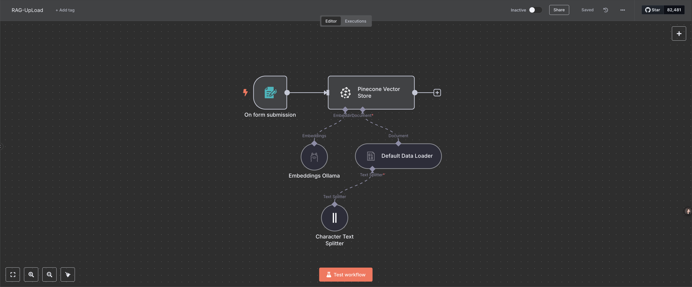
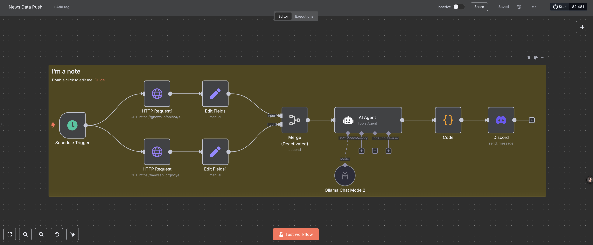

# n8n 工作流解析与 RAG 技术介绍

本文档旨在深入解析当前项目中的四个 n8n 工作流，并详细介绍其中应用的核心技术，特别是检索增强生成（RAG）架构。

## 工作流概述

本部分将逐一分析四个 n8n 工作流，阐明其设计目标、关键节点功能、数据流转路径及核心逻辑。

### 工作流 1: Crawl4AI_Data_Extraction.json


#### 工作流目标
此工作流的核心目标是自动化地从用户指定的网站地图（Sitemap）URL 中提取所有页面链接，批量抓取这些页面的内容，并利用 AI 模型（DeepSeek）将非结构化的网页内容转化为结构化的 Markdown 格式，最终将结果保存为单独的 Markdown 文件，适用于构建知识库或进行后续处理。

#### 节点分析

-   **When chat message received** (`@n8n/n8n-nodes-langchain.chatTrigger`): 作为工作流的入口，通过聊天界面接收用户输入的 Sitemap URL。
    -   **技术解释**: 利用 LangChain 的聊天触发器，提供一个交互式的启动方式，方便用户输入起始 URL。
    -   **关键配置 (来自 JSON)**:
        ```json
        {
          "public": true, // 表明此触发器端点是公开的
          "options": {}
        }
        ```
    -   **引用**: [n8n LangChain Nodes (社区节点)](https://docs.n8n.io/integrations/community-nodes/n8n-nodes-langchain/)

-   **HTTP Request** (`n8n-nodes-base.httpRequest`) (获取 Sitemap): 向用户提供的 Sitemap URL 发送 GET 请求，获取 XML 文件内容。
    -   **技术解释**: 标准的 HTTP 客户端节点，用于从 Web 服务器请求资源。是网络数据抓取的基础。
    -   **关键配置 (来自 JSON)**:
        ```json
        {
          "url": "{{ $json.chatInput }}", // 动态使用聊天输入作为请求 URL
          "options": {}
        }
        ```
    -   **引用**: [n8n HTTP Request Node](https://docs.n8n.io/nodes/n8n-nodes-base.httpRequest/)

-   **XML** (`n8n-nodes-base.xml`): 解析上一步获取的 Sitemap XML 内容，提取其中 `urlset.url` 路径下的所有 URL 链接。
    -   **技术解释**: n8n 内置的 XML 解析器，能够将 XML 文本转换为结构化的 JSON 数据，方便提取所需信息。
    -   **关键配置 (来自 JSON)**:
        ```json
        {
          "dataPropertyName": "data", // 指定输出的 JSON 属性名
          "options": {}
        }
        ```
    -   **引用**: [n8n XML Node](https://docs.n8n.io/nodes/n8n-nodes-base.xml/)

-   **Split Out** (`n8n-nodes-base.splitOut`): 将 XML 节点提取出的 URL 列表（数组）拆分成多个独立的数据项，每个项包含一个 URL，以便后续节点可以逐个处理。
    -   **技术解释**: 数据流处理节点，用于将数组或列表结构扁平化为独立的项目流，是进行批量处理的常用前置步骤。
    -   **关键配置 (来自 JSON)**:
        ```json
        {
          "fieldToSplitOut": "urlset.url", // 指定要拆分的字段路径
          "options": {}
        }
        ```
    -   **引用**: [n8n Item Lists Node](https://docs.n8n.io/nodes/n8n-nodes-base.itemLists/)

-   **Limit** (`n8n-nodes-base.limit`): 限制传递到后续流程的 URL 数量，此处设置为最多 10 个。
    -   **技术解释**: 控制数据流量，防止因处理大量数据项导致工作流过载或耗时过长，常用于测试或演示场景，或对处理范围进行约束。
    -   **关键配置 (来自 JSON)**:
        ```json
        {
          "maxItems": 10 // 最大项目数
        }
        ```
    -   **引用**: [n8n Limit Node](https://docs.n8n.io/nodes/n8n-nodes-base.limit/)

-   **Loop Over Items** (`n8n-nodes-base.splitInBatches`): 以指定批次大小（此处为 2）对通过 Limit 节点的 URL 进行循环处理。
    -   **技术解释**: 用于迭代处理项目列表。分批处理（Batching）可以在处理大量项目时提高效率，并可能有助于管理 API 调用速率限制。
    -   **关键配置 (来自 JSON)**:
        ```json
        {
          "batchSize": 2, // 每批处理 2 个项目
          "options": {}
        }
        ```
    -   **引用**: [n8n Loop Over Items Node](https://docs.n8n.io/nodes/n8n-nodes-base.loopOverItems/)

-   **(循环内部)**:
    -   **Wait** (`n8n-nodes-base.wait`): 在每次循环（处理一个批次后）强制等待 7 秒。
        -   **技术解释**: 引入延迟，主要目的是避免过于频繁地请求目标网站服务器，降低被识别为爬虫或触发速率限制的风险，是负责任的网络爬取实践。
        -   **关键配置 (来自 JSON)**:
            ```json
            {
              "amount": 7 // 等待 7 秒
            }
            ```
        -   **引用**: [n8n Wait Node](https://docs.n8n.io/nodes/n8n-nodes-base.wait/)
    -   **HTTP Request** (抓取页面): 对当前循环批次中的每个 URL 发送 HTTP GET 请求，获取实际的网页内容。(*注：JSON 文件中此部分内嵌在循环逻辑里，未单独显示为顶级节点，但功能明确*)
    -   **AI Agent** (`@n8n/n8n-nodes-langchain.agent`): 接收抓取到的网页内容（通常是 HTML 或处理后的 Markdown），并根据提供的 Prompt 指示 **DeepSeek Chat Model** 将内容结构化。
        -   **技术解释**: 这是 LangChain 的核心组件之一。Agent 作为一个决策者，利用 LLM 的推理能力来理解任务（由 Prompt 定义），并可能调用工具（此工作流未显式调用外部工具，而是直接处理输入内容）。它将非结构化的网页文本转化为定义好的、适合知识库的结构化 Markdown。
        -   **关键配置 (来自 JSON)**: (Prompt 较长，仅展示核心指令)
            ```json
            {
              "promptType": "define",
              "text": "角色设定：\n你是一名信息结构化和知识库开发的专家...任务是将 markdown 数据整理为适合 LLM 驱动的 RAG 知识库的结构化、易读格式...\n\n任务要求：\n1. 内容解析...\n2. 结构化整理...\n3. 创建 FAQ（如适用）...\n4. 提升可读性...\n5. 优化输出...", // 详细定义了 AI 的角色、任务、规则和输入格式
              "options": {}
            }
            ```
        -   **引用**: [n8n LangChain Nodes](https://docs.n8n.io/integrations/community-nodes/n8n-nodes-langchain/), [LangChain Agents](https://python.langchain.com/docs/modules/agents/)

    -   **DeepSeek Chat Model** (`@n8n/n8n-nodes-langchain.lmChatDeepSeek`): 执行 AI Agent 发出的指令，实际处理文本并生成结构化的 Markdown 输出。
        -   **技术解释**: 这是一个具体的 LLM 节点，连接到 DeepSeek AI 平台。它接收来自 AI Agent 的指令（包含原始文本和处理要求），并返回处理后的结果。
        -   **关键配置 (来自 JSON)**: (凭证信息已隐藏)
            ```json
            {
              "options": {} // 模型具体参数可能在凭证或默认设置中
            }
            ```
        -   **引用**: [DeepSeek Platform](https://platform.deepseek.com/)

-   **If** (`n8n-nodes-base.if`): 检查上一步 AI 处理结果的状态（通常由 HTTP 请求或 AI 节点返回）。如果状态为 `completed`，则允许数据流向后续的文件保存步骤。
    -   **技术解释**: 条件判断节点，用于根据特定条件控制工作流的分支走向，确保只有成功处理的数据才会被保存。
    -   **关键配置 (来自 JSON)**:
        ```json
        {
          "conditions": {
            "conditions": [
              {
                "leftValue": "{{ $json.status }}", // 检查输入 JSON 中的 status 字段
                "rightValue": "completed",
                "operator": { "operation": "equals" } // 判断是否等于 "completed"
              }
            ]
          }
        }
        ```
    -   **引用**: [n8n If Node](https://docs.n8n.io/nodes/n8n-nodes-base.if/)

-   **Convert to File** (`n8n-nodes-base.convertToFile`): 将 AI Agent 输出的结构化文本内容（存储在 `output` 字段）转换为 n8n 的文件对象。文件名被设定为基于输出内容的第一行，并添加 `.md` 后缀。
    -   **技术解释**: 在 n8n 内部数据结构和文件对象之间进行转换，是写入文件前的必要步骤。动态设置文件名增加了灵活性。
    -   **关键配置 (来自 JSON)**:
        ```json
        {
          "operation": "toText",
          "sourceProperty": "output", // 源数据字段
          "options": {
            "fileName": "{{ $json.output.split('\n')[0] }}.md" // 动态设置文件名
          }
        }
        ```
    -   **引用**: [n8n Convert To File Node](https://docs.n8n.io/nodes/n8n-nodes-base.convertToFile/)

-   **Read/Write Files from Disk** (`n8n-nodes-base.readWriteFile`): 将上一步生成的 n8n 文件对象实际写入到运行 n8n 的服务器的指定路径下。文件名使用了当前时间戳以确保唯一性。
    -   **技术解释**: 实现与本地（或挂载的）文件系统的交互，完成数据的持久化存储。
    -   **关键配置 (来自 JSON)**:
        ```json
        {
          "operation": "write",
          "fileName": "=/home/node/{{ new Date().getTime() }}.md", // 写入路径和时间戳文件名
          "options": {}
        }
        ```
    -   **引用**: [n8n Read/Write File Node](https://docs.n8n.io/nodes/n8n-nodes-base.readWriteFile/)

#### 数据流向与逻辑
1.  工作流由聊天消息触发，接收 Sitemap URL。
2.  获取并解析 Sitemap XML，提取所有 URL。
3.  URL 列表被拆分、限制数量 (≤10)，然后分批 (每批 2 个) 进入循环。
4.  在循环的每一轮中：
    a.  首先等待 7 秒。
    b.  抓取当前批次 URL 的网页内容。
    c.  将内容提交给 AI Agent 进行结构化处理 (使用 DeepSeek 模型)。
    d.  检查 AI 处理是否成功 (status == "completed")。
    e.  如果成功，将结果转换为文件对象，并以时间戳命名写入磁盘。
5.  循环处理完所有批次后，工作流结束。

---

### 工作流 2: RAG_UpLoad.json



#### 工作流目标
此工作流旨在提供一个用户友好的界面（Web 表单），接收用户上传的文档（支持 PDF, Markdown, CSV 格式）。上传后，工作流自动对文档内容进行分块（Chunking），使用 Ollama 本地运行的嵌入模型将文本块转换为向量表示，并将这些向量连同原始文本和元数据一起存储到 Pinecone 向量数据库的指定索引和命名空间中。这是构建 RAG 知识库的数据入口。

#### 节点分析

-   **On form submission** (`n8n-nodes-base.formTrigger`): 创建一个可以通过 URL 访问的 Web 表单，包含一个文件上传字段，限制接受 `.pdf`, `.md`, `.csv` 类型的文件。
    -   **技术解释**: 表单触发器，将用户通过 Web 界面提交的数据（包括文件）作为工作流的启动输入。
    -   **关键配置 (来自 JSON)**:
        ```json
        {
          "formTitle": "Upload Files",
          "formFields": {
            "values": [
              {
                "fieldLabel": "Files",
                "fieldType": "file",
                "acceptFileTypes": ".pdf,.md,.csv" // 文件类型限制
              }
            ]
          }
        }
        ```
    -   **引用**: [n8n Form Trigger Node](https://docs.n8n.io/nodes/n8n-nodes-base.formTrigger/)

-   **Character Text Splitter** (`@n8n/n8n-nodes-langchain.textSplitterCharacterTextSplitter`): 接收来自 Data Loader 的文档内容，并将其按照固定字符数（500）进行分割成文本块 (Chunks)。
    -   **技术解释**: 这是 RAG 流程中关键的数据预处理步骤。将长文档分割成小块有助于嵌入模型更好地捕捉局部语义，并且可以避免超出模型的上下文窗口限制。`chunkSize: 500` 定义了每个块的最大字符数。选择合适的 `chunkSize` 对检索效果很重要，太小可能丢失上下文，太大可能包含过多无关信息。
    -   **关键配置 (来自 JSON)**:
        ```json
        {
          "chunkSize": 500, // 每个文本块的最大字符数
          "options": {} // 可配置 chunkOverlap 等参数
        }
        ```
    -   **引用**: [LangChain Text Splitters](https://python.langchain.com/docs/modules/data_connection/document_transformers/), [n8n LangChain Nodes](https://docs.n8n.io/integrations/community-nodes/n8n-nodes-langchain/)

-   **Default Data Loader** (`@n8n/n8n-nodes-langchain.documentDefaultDataLoader`): 从表单触发器接收上传的二进制文件数据，将其加载为 LangChain 的 Document 对象，并将其传递给 **Character Text Splitter**。它还配置了将原始文件名作为元数据附加到文档对象上。
    -   **技术解释**: LangChain 的 Document Loader 负责将各种来源（文件、数据库、网页等）的数据加载并转换成标准的 Document 格式（包含 `page_content` 和 `metadata`）。这里的配置表明它处理的是二进制数据，并将文件名存入元数据，这在后续检索时可能有用。
    -   **关键配置 (来自 JSON)**:
        ```json
        {
          "dataType": "binary", // 指定处理二进制文件数据
          "options": {
            "metadata": {
              "metadataValues": [
                {
                  "name": "file",
                  "value": "{{ $json.Files[0].filename }}" // 将文件名存入 metadata.file
                }
              ]
            }
          }
        }
        ```
    -   **引用**: [LangChain Document Loaders](https://python.langchain.com/docs/modules/data_connection/document_loaders/), [n8n LangChain Nodes](https://docs.n8n.io/integrations/community-nodes/n8n-nodes-langchain/)

-   **Embeddings Ollama** (`@n8n/n8n-nodes-langchain.embeddingsOllama`): 连接到本地运行的 Ollama 服务，使用指定的嵌入模型 `mxbai-embed-large-2k:latest` 来计算文本块的向量表示。
    -   **技术解释**: 文本嵌入（Embeddings）是将文本（单词、句子、段落）映射到高维向量空间的过程，使得语义相似的文本在向量空间中距离更近。Ollama 节点负责调用本地运行的 Ollama AI 服务来执行这个转换。`mxbai-embed-large-2k:latest` 是一个具体的嵌入模型名称，"large" 可能表示其参数规模较大，"2k" 可能指其支持的上下文长度。选择合适的嵌入模型对 RAG 的检索质量至关重要。
    -   **关键配置 (来自 JSON)**: (凭证信息已隐藏)
        ```json
        {
          "model": "mxbai-embed-large-2k:latest" // 指定使用的 Ollama 嵌入模型
        }
        ```
    -   **引用**: [Ollama Embedding Models](https://ollama.com/blog/embedding-models), [LangChain Embeddings](https://python.langchain.com/docs/modules/data_connection/text_embedding/), [n8n LangChain Nodes](https://docs.n8n.io/integrations/community-nodes/n8n-nodes-langchain/)

-   **Pinecone Vector Store** (`@n8n/n8n-nodes-langchain.vectorStorePinecone`): 负责将处理好的数据（包含原始文本块、生成的向量嵌入和元数据）写入（Upsert）到 Pinecone 向量数据库。
    -   **技术解释**: 这是 RAG 知识库的存储核心。Pinecone 是一个专门为高效向量相似性搜索设计的数据库。此节点配置为执行 `insert` 操作，将数据存入名为 `n8n-ollama-1024` 的索引和 `Vue` 的命名空间（Namespace）中。命名空间允许在同一个索引内隔离不同的数据集，例如按用户或主题隔离。Upsert 操作意味着如果具有相同 ID 的记录已存在，则会更新它，否则会插入新记录。
    -   **关键配置 (来自 JSON)**: (凭证信息已隐藏)
        ```json
        {
          "mode": "insert", // 操作模式为插入
          "pineconeIndex": { // 目标索引信息
            "__rl": true,
            "value": "n8n-ollama-1024", // 索引名称
            "mode": "list",
            "cachedResultName": "n8n-ollama-1024"
          },
          "options": {
            "pineconeNamespace": "Vue" // 目标命名空间
          }
        }
        ```
    -   **引用**: [Pinecone Documentation](https://docs.pinecone.io/), [LangChain Vector Stores](https://python.langchain.com/docs/modules/data_connection/vectorstores/), [n8n LangChain Nodes](https://docs.n8n.io/integrations/community-nodes/n8n-nodes-langchain/)

#### 数据流向与逻辑
1.  用户通过 Web 表单上传一个或多个文档。
2.  **Form Trigger** 节点捕获提交，并将文件数据传递给 **Default Data Loader**。
3.  **Default Data Loader** 加载文件内容，提取文件名作为元数据，并将 Document 对象传递给 **Character Text Splitter**。
4.  **Character Text Splitter** 将 Document 内容分割成多个小的文本块 (Chunks)。
5.  这些文本块（现在是多个 LangChain Document 对象，每个包含一小块文本和元数据）被传递给 **Pinecone Vector Store** 节点。
6.  **Pinecone Vector Store** 节点对于接收到的每一个文本块，调用 **Embeddings Ollama** 节点来生成其向量嵌入。
7.  最后，**Pinecone Vector Store** 节点将每个文本块的原始文本、生成的向量嵌入以及元数据一起存入（Upsert）到配置的 Pinecone 索引和命名空间中。
8.  工作流执行完毕，数据成功存入向量数据库。

---

### 工作流 3: RAG_Search.json


#### 工作流目标
此工作流实现了一个基于 RAG (Retrieval-Augmented Generation) 技术的交互式问答系统。它通过聊天界面接收用户关于 Vue.js 技术的问题，利用 LangChain Agent 协调，先通过 **Embeddings Ollama** 将问题转换为向量，然后在 **Pinecone Vector Store** 中检索相关的文档片段，最后使用 **DeepSeek Chat Model** 结合检索到的上下文信息生成答案，并利用 **Simple Memory** 维护对话历史。

#### 节点分析

-   **When chat message received** (`@n8n/n8n-nodes-langchain.chatTrigger`): 监听聊天输入，接收用户提出的关于 Vue 的问题。
    -   **技术解释**: 作为聊天机器人的入口点，捕获用户输入。
    -   **关键配置 (来自 JSON)**:
        ```json
        {
          "public": true, // 公开访问端点
          "options": {}
        }
        ```
    -   **引用**: [n8n LangChain Nodes](https://docs.n8n.io/integrations/community-nodes/n8n-nodes-langchain/)

-   **AI Agent** (`@n8n/n8n-nodes-langchain.agent`): 工作流的核心协调者。它接收用户问题，利用 LLM (DeepSeek) 进行思考和规划，决定何时以及如何使用可用的工具（即向量存储工具），并管理对话记忆。配置了一个系统消息，指示其专注于回答 Vue 技术问题。
    -   **技术解释**: LangChain Agent 模拟了自主决策的过程。它不直接回答问题，而是根据自身能力、可用工具和对话历史来决定最佳行动方案。这里的 Agent 被配置为可以访问一个向量存储工具来获取专业知识。
    -   **关键配置 (来自 JSON)**:
        ```json
        {
          "hasOutputParser": true, // 通常需要解析器来处理 Agent 的输出
          "options": {
            "systemMessage": "You are a helpful assistant,you can access a vector database of Vue technical documentation, which specializes in Vue technology." // 定义 Agent 的角色和能力
          }
        }
        ```
    -   **引用**: [LangChain Agents](https://python.langchain.com/docs/modules/agents/), [n8n LangChain Nodes](https://docs.n8n.io/integrations/community-nodes/n8n-nodes-langchain/)

-   **DeepSeek Chat Model** (`@n8n/n8n-nodes-langchain.lmChatDeepSeek`) (连接到 Agent 的 `ai_languageModel`): 为 AI Agent 提供主要的推理和自然语言生成能力。Agent 用它来理解问题、规划步骤、调用工具以及生成最终面向用户的回复。
    -   **技术解释**: 这是 Agent 进行"思考"和"说话"所依赖的大语言模型。
    -   **关键配置 (来自 JSON)**: (凭证信息已隐藏)
        ```json
        {
          "options": {} // 模型参数可能在凭证或默认设置中
        }
        ```
    -   **引用**: [DeepSeek Platform](https://platform.deepseek.com/), [LangChain Chat Models](https://python.langchain.com/docs/modules/model_io/chat/)

-   **Simple Memory** (`@n8n/n8n-nodes-langchain.memoryBufferWindow`): 连接到 AI Agent 的 `ai_memory` 输入，用于存储最近的对话历史（用户问题和 AI 回答）。
    -   **技术解释**: LangChain 的 Memory 组件使得 Agent 能够"记住"之前的对话内容，从而进行连贯的多轮交流，理解指代关系（如"它怎么样？"中的"它"）。Buffer Window Memory 会保留最近的 N 轮对话。
    -   **关键配置 (来自 JSON)**:
        ```json
        {} // 使用默认配置，如窗口大小
        ```
    -   **引用**: [LangChain Memory](https://python.langchain.com/docs/modules/memory/), [n8n LangChain Nodes](https://docs.n8n.io/integrations/community-nodes/n8n-nodes-langchain/)

-   **Answer questions with a vector store** (`@n8n/n8n-nodes-langchain.toolVectorStore`): 作为 AI Agent 可调用的工具，专门负责执行 RAG 流程中的检索和基于检索的问答部分。
    -   **技术解释**: LangChain Tool 封装了一项具体能力。这个工具的核心是连接到一个向量存储（Pinecone）和一个用于合成答案的 LLM（DeepSeek）。当 Agent 决定需要从知识库获取信息时，就会调用这个工具。
    -   **关键配置 (来自 JSON)**:
        ```json
        {
          "name": "Vue" // 工具的名称，Agent 会通过这个名称调用它
        }
        ```
    -   **引用**: [LangChain Tools](https://python.langchain.com/docs/modules/agents/tools/), [n8n LangChain Nodes](https://docs.n8n.io/integrations/community-nodes/n8n-nodes-langchain/)

-   **Pinecone Vector Store** (`@n8n/n8n-nodes-langchain.vectorStorePinecone`) (连接到 Tool 的 `ai_vectorStore`): 提供实际的向量检索能力。它连接到存储 Vue 文档向量的 Pinecone 索引 (`n8n-ollama-1024`) 和命名空间 (`Vue`)。
    -   **技术解释**: 当 VectorStore Tool 被调用时，它会指示此节点执行相似性搜索。此节点需要知道使用哪个嵌入模型来转换查询。
    -   **关键配置 (来自 JSON)**: (凭证信息已隐藏)
        ```json
        {
          "pineconeIndex": { // 目标索引
            "value": "n8n-ollama-1024"
          },
          "options": {
            "pineconeNamespace": "Vue" // 目标命名空间
          }
        }
        ```
    -   **引用**: [Pinecone Documentation](https://docs.pinecone.io/), [LangChain Vector Stores](https://python.langchain.com/docs/modules/data_connection/vectorstores/)

-   **Embeddings Ollama** (`@n8n/n8n-nodes-langchain.embeddingsOllama`) (连接到 Pinecone Store 的 `ai_embedding`): 当需要进行向量检索时，此节点负责将用户传入的查询问题（由 Tool 传递）使用本地 Ollama 服务和 `mxbai-embed-large-2k:latest` 模型转换为向量嵌入。
    -   **技术解释**: 这是执行向量搜索前必不可少的一步，确保查询问题和数据库中存储的文档使用相同的向量空间表示，才能计算有意义的相似度。
    -   **关键配置 (来自 JSON)**: (凭证信息已隐藏)
        ```json
        {
          "model": "mxbai-embed-large-2k:latest" // 用于查询的嵌入模型
        }
        ```
    -   **引用**: [Ollama Embedding Models](https://ollama.com/blog/embedding-models), [LangChain Embeddings](https://python.langchain.com/docs/modules/data_connection/text_embedding/)

-   **DeepSeek Chat Model** (`@n8n/n8n-nodes-langchain.lmChatDeepSeek`) (连接到 Tool 的 `ai_languageModel`): 这个 LLM 专门用于 **VectorStore Tool** 内部。当工具从 Pinecone 检索到相关的文档片段后，它会使用这个 DeepSeek 模型，将原始问题和检索到的上下文结合起来，生成一个基于证据的、更准确的答案。
    -   **技术解释**: 这是 RAG 中"生成"（Generation）步骤的核心。它不依赖 Agent 的主 LLM，而是专注于根据检索到的信息合成答案，确保答案紧密围绕知识库内容。
    -   **关键配置 (来自 JSON)**: (凭证信息已隐藏)
        ```json
        {
          "options": {}
        }
        ```
    -   **引用**: [DeepSeek Platform](https://platform.deepseek.com/)

#### 数据流向与逻辑
1.  用户在聊天界面输入关于 Vue 的问题。
2.  **Chat Trigger** 激活 **AI Agent**。
3.  **AI Agent** 结合 **Simple Memory** 中的对话历史和 **DeepSeek Chat Model** (主模型) 的理解，分析用户问题。
4.  Agent 决定需要查询 Vue 知识库，于是调用名为 "Vue" 的工具 (**Answer questions with a vector store**)。
5.  该工具接收到用户问题。
6.  工具调用 **Embeddings Ollama** 将问题转换为查询向量。
7.  工具使用查询向量，指示 **Pinecone Vector Store** 在 `n8n-ollama-1024` 索引的 `Vue` 命名空间中进行相似性搜索，检索出最相关的文档块。
8.  工具将检索到的文档块和原始问题一起传递给其内部的 **DeepSeek Chat Model** (工具模型)。
9.  工具模型生成基于检索内容的答案。
10. 工具将生成的答案返回给 **AI Agent**。
11. **AI Agent** (主模型) 接收到工具的答案，可能进行最终的润色或格式化，然后将最终回复发送给用户，并更新 **Simple Memory**。

---

### 工作流 4: News_Data_Push.json



#### 工作流目标
此工作流设计为一个自动化的新闻聚合与推送系统。它每天定时（早上 8 点）触发，从两个不同的新闻 API (NewsAPI 和 GNews.io) 获取关于人工智能 (AI) 的最新英文新闻文章。然后，它使用本地运行的 Ollama AI 模型对获取到的新闻进行筛选和摘要生成，最后将格式化后的新闻摘要推送到指定的 Discord 频道。

#### 节点分析

-   **Schedule Trigger** (`n8n-nodes-base.scheduleTrigger`): 定时器，配置为在每天早上 8 点触发工作流执行。
    -   **技术解释**: n8n 的基础触发器之一，用于按预定时间或周期性地自动运行工作流，非常适合定时报告、数据同步等任务。
    -   **关键配置 (来自 JSON)**:
        ```json
        {
          "rule": {
            "interval": [ { "triggerAtHour": 8 } ] // 每天 8 点触发
          }
        }
        ```
    -   **引用**: [n8n Schedule Trigger Node](https://docs.n8n.io/nodes/n8n-nodes-base.scheduleTrigger/)

-   **HTTP Request** (`n8n-nodes-base.httpRequest`) x2: 两个独立的 HTTP 请求节点，分别配置了不同的 URL 和 API 密钥，用于从 NewsAPI 和 GNews.io 获取关于 "ai" 的英文新闻。
    -   **技术解释**: 用于调用外部 Web API。每个节点配置了相应的 API 端点、查询参数（如 `q=ai`, `lang=en`）和认证所需的 API 密钥。
    -   **关键配置 (来自 JSON)**: (URL 中包含查询参数和 API Key)
        ```json
        // NewsAPI 节点
        { "url": "https://newsapi.org/v2/everything?q=ai&lang=en&apiKey=...", ... }
        // GNews.io 节点
        { "url": "https://gnews.io/api/v4/search?q=ai&lang=en&apikey=...", ... }
        ```
    -   **引用**: [n8n HTTP Request Node](https://docs.n8n.io/nodes/n8n-nodes-base.httpRequest/), [NewsAPI Documentation](https://newsapi.org/docs), [GNews.io Documentation](https://gnews.io/docs/v4?lang=en)

-   **Edit Fields** (`n8n-nodes-base.set`) x2: 每个 HTTP 请求节点后面跟着一个 Set 节点，用于从 API 返回的复杂 JSON 响应中提取出包含新闻文章列表的关键字段 `articles`。
    -   **技术解释**: 数据转换节点，用于简化数据结构，只保留后续步骤需要的字段，使数据流更清晰。
    -   **关键配置 (来自 JSON)**:
        ```json
        {
          "assignments": {
            "assignments": [ { "name": "articles", "value": "{{ $json.articles }}" } ] // 保留 articles 字段
          }
        }
        ```
    -   **引用**: [n8n Set Node](https://docs.n8n.io/nodes/n8n-nodes-base.set/)

-   **Merge** (`n8n-nodes-base.merge`): 此节点被禁用 (disabled: true)。如果启用，它的作用是将来自两个新闻源（经过 Set 节点处理后）的数据流合并成一个数据流，以便后续节点统一处理。
    -   **技术解释**: 数据流合并节点，用于处理工作流中的分支。可以配置不同的合并模式（如 Append, Merge by Index, Merge by Key）。
    -   **引用**: [n8n Merge Node](https://docs.n8n.io/nodes/n8n-nodes-base.merge/)

-   **AI Agent** (`@n8n/n8n-nodes-langchain.agent`): 接收来自上游（当前只有一个源，因为 Merge 禁用了）的新闻文章列表。其 Prompt 指示它扮演 AI 新闻编辑的角色，从输入中筛选最多 5 条 AI 相关新闻，并按照特定格式生成包含日期、序号、标题、原文链接和简明中文描述的摘要。
    -   **技术解释**: LangChain Agent 在这里被用作一个强大的文本处理和生成工具。它利用 LLM (Ollama) 的能力来理解复杂的指令（筛选、摘要、格式化）并处理输入的新闻数据。
    -   **关键配置 (来自 JSON)**: (Prompt 核心内容)
        ```json
        {
          "promptType": "define",
          "text": "角色定义：你是一位专业的AI新闻编辑...直接输出高质量的新闻内容...格式：...[按照以下格式直接输出15条以内的AI新闻]...📌 [序号]. [标题]\n[原文链接][URL]\n[简明扼要的中文描述...]...", // 指示 AI 的角色、任务、格式要求和示例
          "hasOutputParser": true, // 可能需要解析器处理 LLM 的特定输出格式
          "options": {}
        }
        ```
    -   **引用**: [LangChain Agents](https://python.langchain.com/docs/modules/agents/), [n8n LangChain Nodes](https://docs.n8n.io/integrations/community-nodes/n8n-nodes-langchain/)

-   **Ollama Chat Model** (`@n8n/n8n-nodes-langchain.lmChatOllama`): 连接到 AI Agent 的 `ai_languageModel` 输入，提供实际的语言模型能力。它使用本地运行的 Ollama 服务和 `deepseek-r1:8b` 模型来执行 AI Agent 的新闻摘要和格式化任务。
    -   **技术解释**: 调用本地 Ollama 服务执行 LLM 推理。选择 `deepseek-r1:8b` 模型进行新闻摘要。
    -   **关键配置 (来自 JSON)**: (凭证信息已隐藏)
        ```json
        {
          "model": "deepseek-r1:8b", // 指定使用的 Ollama 聊天模型
          "options": {}
        }
        ```
    -   **引用**: [Ollama](https://ollama.com/), [LangChain Chat Models](https://python.langchain.com/docs/modules/model_io/chat/)

-   **Code** (`n8n-nodes-base.code`): 接收 AI Agent 生成的摘要文本，并执行一小段 JavaScript 代码。这段代码的作用是使用正则表达式移除文本中可能存在的 `<think>` 标签及其包含的所有内容，以清理最终输出。
    -   **技术解释**: 代码节点提供了极高的灵活性，允许用户编写自定义逻辑来处理 n8n 中的数据。这里用于后处理 AI 的输出，确保格式干净。
    -   **关键配置 (来自 JSON)**:
        ```javascript
        // jsCode content:
        const content = items[0].json.output;
        const cleanContent = content.replace(/<think>[\s\S]*?<\/think>/g, ''); // 正则移除 think 标签
        return { json: { output: cleanContent } };
        ```
    -   **引用**: [n8n Code Node](https://docs.n8n.io/nodes/n8n-nodes-base.code/)

-   **Discord** (`n8n-nodes-base.discord`): 将 **Code** 节点清理后的新闻摘要文本作为消息内容，发送到预先配置好的 Discord 服务器的特定频道 (通过 Guild ID 和 Channel ID 指定)。
    -   **技术解释**: n8n 与 Discord 的集成节点，允许自动化地向 Discord 发送消息、管理频道等。需要配置 Discord Bot 的 API 凭证。
    -   **关键配置 (来自 JSON)**: (凭证和 ID 已部分隐藏)
        ```json
        {
          "resource": "message",
          "guildId": { "value": "1361697251457630269", ... }, // 服务器 ID
          "channelId": { "value": "1361697251457630275", ... }, // 频道 ID
          "content": "{{ $json.output }}", // 使用 Code 节点输出作为消息内容
          "options": {}
        }
        ```
    -   **引用**: [n8n Discord Node](https://docs.n8n.io/nodes/n8n-nodes-base.discord/), [Discord Developer Portal](https://discord.com/developers/docs/intro)

#### 数据流向与逻辑
1.  **Schedule Trigger** 在每天早上 8 点启动工作流。
2.  两个 **HTTP Request** 节点并行执行，分别从 NewsAPI 和 GNews.io 获取 AI 相关新闻。
3.  每个 HTTP 请求的响应经过各自的 **Edit Fields** 节点，提取出 `articles` 列表。
4.  (*由于 Merge 节点禁用*) 来自 GNews.io 的 `articles` 数据流向 **AI Agent**。(注: 当前逻辑似乎只处理了 GNews.io 的数据源，NewsAPI 的数据未被使用。如果 Merge 节点启用，则会合并两个来源的数据。)
5.  **AI Agent** 接收文章列表，调用 **Ollama Chat Model** (`deepseek-r1:8b`) 生成格式化的新闻摘要。
6.  摘要文本传递给 **Code** 节点进行清理（移除 `<think>` 标签）。
7.  清理后的摘要文本通过 **Discord** 节点发送到指定的 Discord 频道。
8.  工作流执行结束。

---

## 技术详解

本节将深入探讨在上述 n8n 工作流中广泛使用的关键技术和概念。

### Pinecone 向量数据库

-   **工作原理**: Pinecone 是一种专门设计用于存储和检索高维向量（Vector Embeddings）的云原生数据库。它的核心功能是 **近似最近邻 (Approximate Nearest Neighbor, ANN)** 搜索。当我们将文本、图片或其他数据转换成向量后存入 Pinecone，它会构建高效的索引结构。当有新的查询向量（例如，用户问题的向量表示）时，Pinecone 能够极快地（通常在毫秒级）在数十亿级别的向量中找到与查询向量在语义上最相似的向量集合。相似度通常通过余弦相似度 (Cosine Similarity) 或欧氏距离 (Euclidean Distance) 等度量来计算。
-   **在工作流中的应用**:
    -   在 `RAG_UpLoad.json` 中，Pinecone 作为知识库的存储后端。**Embeddings Ollama** 生成的文本块向量被写入 Pinecone 的 `n8n-ollama-1024` 索引和 `Vue` 命名空间。每个向量通常会关联其原始文本块以及元数据（如来源文件名）。
    -   在 `RAG_Search.json` 中，Pinecone 被用作 RAG 流程的检索核心。**Answer questions with a vector store** 工具接收用户问题的向量表示，查询 Pinecone 以找到最相关的 Vue 文档片段，这些片段随后被用于生成答案。
-   **关键配置解释**:
    -   `index_name` ("n8n-ollama-1024"): 存储向量数据的具体索引实例。创建索引时需要指定维度（匹配嵌入模型输出）和距离度量。
    -   `namespace` ("Vue"): 在索引内部创建逻辑分区，用于隔离数据。在此项目中，它可能用于专门存储与 Vue.js 相关的内容，允许多个主题或用户的数据共存于同一索引而互不干扰。
    -   `embed` (在 `create_index_for_model` 时使用): Pinecone 支持与托管的嵌入模型集成，可以直接处理文本输入/输出，自动完成向量化。本项目的 `RAG_Search` 工作流中，虽然查询时传递了文本，但向量化是由外部的 Ollama 节点完成的，Pinecone 节点接收的是向量。而在 `RAG_UpLoad` 中，Pinecone 节点协调 Ollama 进行嵌入。
-   **引用**: [Pinecone Documentation](https://docs.pinecone.io/)

### LangChain AI Agent

-   **工作原理**: LangChain Agent 是一种利用大型语言模型 (LLM) 作为推理引擎的框架。Agent 接收输入（如用户问题），通过 LLM 进行"思考"来理解目标、分解任务、选择合适的工具，并规划执行步骤。它可以调用一个或多个预定义的"工具 (Tools)"来执行特定任务（如数据库查询、API 调用、代码执行等），然后根据工具返回的结果再次进行推理，最终生成响应。Agent 通常还与"记忆 (Memory)"组件结合，以维持对话的上下文。
-   **在工作流中的应用**:
    -   在 `Crawl4AI_Data_Extraction.json` 中，AI Agent 被用作一个结构化处理器。它接收非结构化的网页内容，并根据 Prompt 中定义的复杂指令，指导 DeepSeek 模型将其重构成适合知识库的 Markdown 格式。这里它主要利用 LLM 的文本理解和生成能力，而非调用外部工具。
    -   在 `RAG_Search.json` 中，AI Agent 扮演核心协调者的角色。它管理与用户的多轮对话（通过 Simple Memory），理解用户关于 Vue 的问题，并决定何时需要调用 "Answer questions with a vector store" 工具来从 Pinecone 获取专业知识，最后整合信息生成回复。
    -   在 `News_Data_Push.json` 中，AI Agent 负责根据 Prompt 指令，对输入的新闻文章列表进行筛选、摘要生成和格式化，输出最终的 Discord 消息内容。
-   **关键配置解释**:
    -   `systemMessage` / `text` (Prompt): 这是指导 Agent 行为的核心。它定义了 Agent 的角色（如"Vue 技术助手"、"AI 新闻编辑"）、能力、任务目标、输出格式要求以及任何约束条件。精心设计的 Prompt 对 Agent 的性能至关重要。
    -   `ai_languageModel` 连接: 指定 Agent 进行推理和生成所使用的 LLM (如 DeepSeek, Ollama)。
    -   `ai_memory` 连接: 指定 Agent 用于存储和检索对话历史的 Memory 组件。
    -   `ai_tool` 连接: 将可用的工具连接到 Agent，使其能够在需要时调用。
-   **引用**: [LangChain Agents](https://python.langchain.com/docs/modules/agents/), [n8n LangChain Nodes](https://docs.n8n.io/integrations/community-nodes/n8n-nodes-langchain/)

### Ollama Embeddings (`mxbai-embed-large-2k:latest`)

-   **工作原理**: 文本嵌入是将文本数据转换为数值向量的过程，目的是捕捉文本的语义信息。语义相近的文本在向量空间中的距离也相近。Ollama 是一个允许在本地运行开源 LLM 和嵌入模型的工具。`Embeddings Ollama` 节点利用本地 Ollama 服务来调用指定的嵌入模型（此处为 `mxbai-embed-large-2k:latest`），对输入的文本（文档块或查询）进行计算，输出其对应的向量表示（一个浮点数列表）。
-   **在工作流中的应用**:
    -   在 `RAG_UpLoad.json` 中，此节点为每个文档块生成向量嵌入，以便存入 Pinecone。
    -   在 `RAG_Search.json` 中，此节点将用户的查询问题转换为向量嵌入，以便在 Pinecone 中进行相似性搜索。
-   **模型 `mxbai-embed-large-2k:latest`**:
    -   这是一个具体的嵌入模型名称。`mxbai-embed-large` 表明它是一个相对较大的嵌入模型，通常意味着参数量多，可能捕捉更丰富的语义，但计算成本也更高。`2k` 可能指的是它能处理的最大序列长度（Token 数）。使用相同的嵌入模型来索引数据和进行查询是保证检索效果的前提。
-   **引用**: [Ollama Embedding Models](https://ollama.com/blog/embedding-models), [LangChain Embeddings](https://python.langchain.com/docs/modules/data_connection/text_embedding/), [Mxbai Embed Large on Hugging Face (推测)](https://huggingface.co/mixedbread-ai/mxbai-embed-large-v1) (具体模型文档需查找确认)

### Text Splitters (Character Text Splitter)

-   **工作原理**: 由于 LLM 和嵌入模型通常有输入长度限制（Context Window），并且为了让嵌入更精确地反映局部语义，需要将长文档分割成更小的、有意义的文本块（Chunks）。`CharacterTextSplitter` 是 LangChain 提供的一种简单的分割策略，它按照指定的字符数 (`chunkSize`) 来切分文本，并可以设置块之间的重叠部分 (`chunkOverlap`) 以保证上下文的连续性。
-   **在工作流中的应用**:
    -   在 `RAG_UpLoad.json` 中，使用 `CharacterTextSplitter` 将上传的文档内容分割成最大 500 字符的块，为后续的向量化做准备。`chunkSize: 500` 是一个需要根据文档特性和嵌入模型能力进行调整的参数。
-   **引用**: [LangChain Text Splitters](https://python.langchain.com/docs/modules/data_connection/document_transformers/)

### DeepSeek Chat Model

-   **工作原理**: DeepSeek 是一个 AI 研究公司及其提供的大语言模型服务的品牌。`DeepSeek Chat Model` 节点连接到 DeepSeek AI 平台，利用其强大的自然语言理解和生成能力来执行各种任务，如回答问题、生成文本、进行对话、结构化数据等。
-   **在工作流中的应用**:
    -   在 `Crawl4AI_Data_Extraction.json` 中，作为 AI Agent 的后端，负责将网页内容结构化为 Markdown。
    -   在 `RAG_Search.json` 中，一个实例作为 AI Agent 的主推理引擎，另一个实例专门用于 VectorStore Tool 内部，根据检索到的上下文生成最终答案。
-   **引用**: [DeepSeek Platform](https://platform.deepseek.com/)

### Ollama Chat Model (`deepseek-r1:8b`)

-   **工作原理**: 与 `Embeddings Ollama` 类似，此节点利用本地运行的 Ollama 服务来调用指定的聊天/指令遵循模型（此处为 `deepseek-r1:8b`）。这个模型可能是在 DeepSeek 模型基础上微调的，或者是一个独立的开源模型，参数量约为 80 亿 (8B)。它用于执行生成任务，如对话、摘要等。
-   **在工作流中的应用**:
    -   在 `News_Data_Push.json` 中，被 AI Agent 调用，根据 Prompt 指令对新闻文章进行摘要和格式化。
-   **引用**: [Ollama](https://ollama.com/), [LangChain Chat Models](https://python.langchain.com/docs/modules/model_io/chat/)

---

## RAG 技术介绍

### RAG 定义与原理

-   **定义**: 检索增强生成 (Retrieval-Augmented Generation, RAG) 是一种结合了**信息检索 (Retrieval)** 和**文本生成 (Generation)** 两个阶段的人工智能技术框架。它旨在通过让大型语言模型 (LLM) 在生成回答前，先从一个外部的、可信的知识源中检索相关信息，来提升 LLM 回答的准确性、相关性、时效性，并减少"幻觉"现象。
-   **核心原理**:
    1.  **索引 (Indexing)**: 首先，将需要作为知识源的文档集合（如公司文档、产品手册、网页内容等）进行预处理。这通常包括：
        *   **加载 (Loading)**: 读取原始文档。
        *   **分割 (Splitting)**: 将长文档切分成较小的、语义连贯的文本块 (Chunks)。
        *   **嵌入 (Embedding)**: 使用文本嵌入模型（如 `mxbai-embed-large-2k`）将每个文本块转换为高维向量。
        *   **存储 (Storing)**: 将文本块的向量表示及其对应的原始文本和元数据存入向量数据库（如 Pinecone）。
    2.  **检索 (Retrieval)**: 当用户提出查询时：
        *   将用户的查询也使用**相同的嵌入模型**转换为查询向量。
        *   在向量数据库中执行相似性搜索，找到与查询向量最接近（即语义最相关）的 K 个文本块的向量。
        *   获取这 K 个文本块对应的原始文本内容。
    3.  **生成 (Generation)**:
        *   将用户的原始查询和检索到的 K 个相关文本块一起组合成一个**增强的 Prompt (Augmented Prompt)**。
        *   将这个增强的 Prompt 输入给一个大型语言模型 (LLM，如 DeepSeek)。
        *   LLM 基于这个包含额外上下文信息的 Prompt 生成最终的回答。
-   **引用**:
    -   [What Is Retrieval-Augmented Generation aka RAG - NVIDIA Blog](https://blogs.nvidia.com/blog/what-is-retrieval-augmented-generation/)
    -   [What is Retrieval-Augmented Generation (RAG)? - Google Cloud](https://cloud.google.com/use-cases/retrieval-augmented-generation)

### RAG 优势

1.  **提高事实准确性**: 通过引用外部知识源，显著降低 LLM 编造不实信息的风险。
2.  **知识可更新**: 无需重新训练 LLM，只需更新向量数据库中的文档，即可让系统获取最新知识。
3.  **领域专业化**: 可以针对特定领域构建知识库，使通用 LLM 能在该领域提供专业回答。
4.  **增强透明度与可解释性**: 可以追溯答案来源，展示是基于哪些文档片段生成的回答。
5.  **成本效益**: 相较于重新训练或微调大型模型，维护外部知识库的成本更低。
6.  **降低敏感数据风险**: LLM 本身不直接接触或记忆大量私有数据，只在查询时访问相关片段，有助于保护数据隐私。

### 本项目中的 RAG 实现

本项目通过两个核心工作流清晰地展示了 RAG 的关键阶段：

1.  **索引阶段 (`RAG_UpLoad.json`)**:
    *   此工作流负责将外部文档转化为可供检索的知识库。
    *   **Form Trigger** 接收用户上传的文档 (PDF, MD, CSV)。
    *   **Default Data Loader** 加载文档内容。
    *   **Character Text Splitter** 将文档分割成 500 字符的块。
    *   **Embeddings Ollama** (`mxbai-embed-large-2k`) 将每个文本块转换为向量。
    *   **Pinecone Vector Store** 将向量、原始文本块和元数据存储到 `n8n-ollama-1024` 索引的 `Vue` 命名空间。
    *   **这个流程完成了 RAG 所需知识库的构建和索引。**

2.  **检索与生成阶段 (`RAG_Search.json`)**:
    *   此工作流实现了基于 RAG 的问答功能。
    *   **Chat Trigger** 接收用户关于 Vue 的问题。
    *   **AI Agent** 协调流程，决定使用 RAG 工具。
    *   **Embeddings Ollama** (`mxbai-embed-large-2k`) 将用户问题转换为查询向量。
    *   **Pinecone Vector Store** 使用查询向量在 `Vue` 命名空间中检索最相关的文档块。
    *   **DeepSeek Chat Model** (工具内部) 接收原始问题和检索到的文档块（作为增强上下文）。
    *   **DeepSeek Chat Model** 基于增强上下文生成最终答案。
    *   **这个流程完整地执行了 RAG 的检索和生成步骤。**

### 应用前景

RAG 技术是当前构建可靠、可信赖的生成式 AI 应用的主流方法，其应用前景广阔，包括但不限于：
-   企业智能知识库和内部搜索引擎
-   高度准确的客户支持聊天机器人
-   个性化内容推荐系统
-   自动化报告生成（结合实时数据源）
-   代码生成与解释（结合代码库）
-   教育和研究辅助工具

随着嵌入模型、向量数据库和 LLM 技术的持续发展，RAG 的性能和易用性将不断提升，成为各行各业利用 AI 提升效率和创造价值的关键赋能技术。

---

## 环境与依赖

要成功运行本项目中的 n8n 工作流，需要满足以下环境和依赖条件：

1.  **n8n 实例**:
    *   需要一个正在运行的 n8n 实例。工作流本身可能兼容多个 n8n 版本，但建议使用较新的稳定版本以获得最佳兼容性和功能支持。
    *   确保 n8n 实例可以访问互联网以下载社区节点和调用外部 API。

2.  **n8n 社区节点**:
    *   需要在 n8n 实例中安装 `@n8n/n8n-nodes-langchain` 社区节点包，因为它提供了 LangChain 集成的核心功能（Agent, Models, Vector Stores, etc.）。

3.  **本地 Ollama 服务**:
    *   需要在 n8n 实例可访问的机器上（通常是同一台机器或同一网络内）安装并运行 Ollama 服务。
    *   参考: [Ollama 官方网站](https://ollama.com/)
    *   需要通过 Ollama 拉取（pull）以下模型：
        *   嵌入模型: `mxbai-embed-large-2k:latest` (用于 `RAG_UpLoad` 和 `RAG_Search`)
        *   聊天模型: `deepseek-r1:8b` (用于 `News_Data_Push`)
        *   *(`RAG_Search` 中的 Ollama 节点也需要 `mxbai-embed-large-2k` 模型用于查询向量化)*
        *   可以通过命令 `ollama list` 检查已安装的模型。

4.  **n8n 凭证 (Credentials)**:
    *   需要在 n8n 中配置以下类型的凭证：
        *   **DeepSeek API**: 用于连接 DeepSeek AI 平台，需要 API Key。(`Crawl4AI_Data_Extraction`, `RAG_Search`)
        *   **Pinecone API**: 用于连接 Pinecone 向量数据库，需要 API Key 和 Environment。(`RAG_UpLoad`, `RAG_Search`)
        *   **Ollama API**: 用于连接本地运行的 Ollama 服务。通常只需要 Ollama 服务的 Base URL (默认为 `http://localhost:11434`)。(`RAG_UpLoad`, `RAG_Search`, `News_Data_Push`)
        *   **Discord Bot API**: 用于向 Discord 发送消息，需要 Bot Token。(`News_Data_Push`)

5.  **外部服务 API 密钥 (可选/根据需要)**:
    *   **NewsAPI Key**: 如果要运行 `News_Data_Push` 工作流并使用 NewsAPI 数据源，需要在对应的 HTTP Request 节点中配置有效的 API Key。
    *   **GNews.io API Key**: 如果要运行 `News_Data_Push` 工作流并使用 GNews.io 数据源，需要在对应的 HTTP Request 节点中配置有效的 API Key。

6.  **文件系统权限 (如果适用)**:
    *   运行 `Crawl4AI_Data_Extraction` 工作流时，n8n 运行环境需要有权限向 `fileName` 参数指定的路径（如 `/home/node/`) 写入文件。

---

## 参考资源

-   **n8n 相关**:
    -   [n8n 官方文档](https://docs.n8n.io/)
    -   [n8n LangChain 社区节点](https://docs.n8n.io/integrations/community-nodes/n8n-nodes-langchain/)
    -   [n8n 节点索引](https://docs.n8n.io/nodes/)
-   **LangChain 相关**:
    -   [LangChain Python 文档](https://python.langchain.com/docs/get_started/introduction)
    -   [LangChain Agents](https://python.langchain.com/docs/modules/agents/)
    -   [LangChain Memory](https://python.langchain.com/docs/modules/memory/)
    -   [LangChain Text Splitters](https://python.langchain.com/docs/modules/data_connection/document_transformers/)
    -   [LangChain Embeddings](https://python.langchain.com/docs/modules/data_connection/text_embedding/)
    -   [LangChain Vector Stores](https://python.langchain.com/docs/modules/data_connection/vectorstores/)
-   **AI 模型与服务**:
    -   [Pinecone Documentation](https://docs.pinecone.io/)
    -   [Ollama](https://ollama.com/)
    -   [Ollama Embedding Models Blog](https://ollama.com/blog/embedding-models)
    -   [DeepSeek Platform](https://platform.deepseek.com/)
-   **RAG 技术**:
    -   [What Is Retrieval-Augmented Generation aka RAG - NVIDIA Blog](https://blogs.nvidia.com/blog/what-is-retrieval-augmented-generation/)
    -   [What is Retrieval-Augmented Generation (RAG)? - Google Cloud](https://cloud.google.com/use-cases/retrieval-augmented-generation)
    -   [What is retrieval-augmented generation? - IBM Research](https://research.ibm.com/blog/retrieval-augmented-generation-RAG)
-   **外部 API**:
    -   [NewsAPI Documentation](https://newsapi.org/docs)
    -   [GNews.io Documentation](https://gnews.io/docs/v4?lang=en)
    -   [Discord Developer Portal](https://discord.com/developers/docs/intro)


</rewritten_file> 